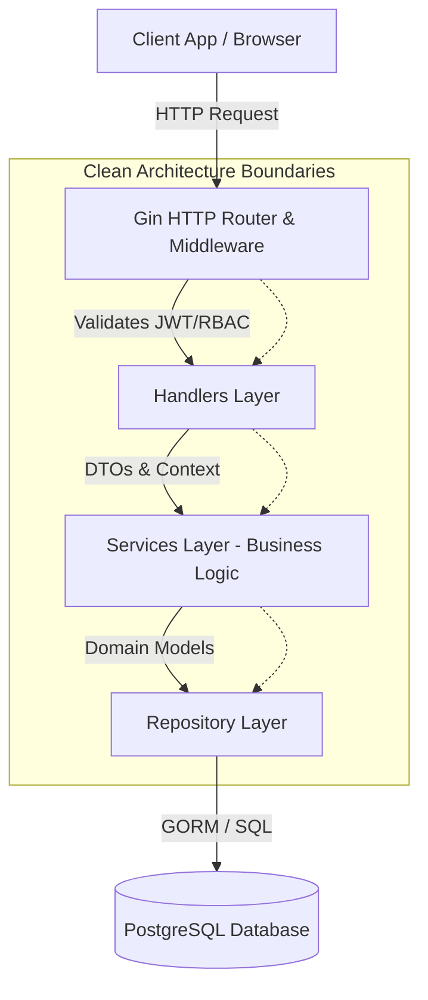
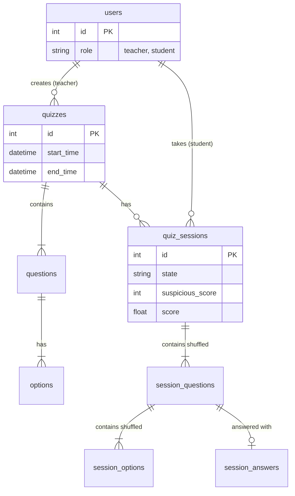
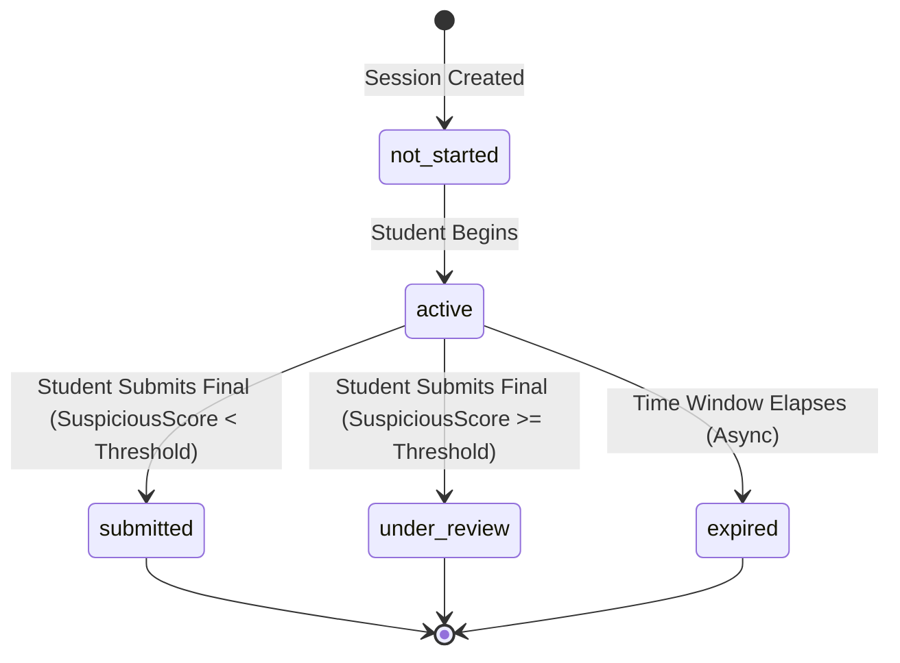

# Secure Online Quiz Backend

This repository contains the backend service for a secure, time-bound online quiz platform. Built in Go, it leverages the Gin web framework and a PostgreSQL relational database. The system is designed to provide authoritative server-side control over quiz execution, strictly enforcing temporal constraints, session validity, and anti-cheating mechanisms.

## Overview

- **Role-Based Access Control**: Distinguishes between `teacher` (quiz creators) and `student` (quiz takers) entities.
- **Server-Authoritative Temporal Constraints**: Quiz availability and session durations are evaluated exclusively against server time.
- **Cheating Mitigation**: Tracks browser focus loss events and applies deterministic score deductions.
- **Concurrent Session Prevention**: Enforces a strict one-active-session-per-student policy via database constraints.
- **Randomization**: Shuffles questions and options per session to prevent pattern sharing among students.

## Architecture

The application adheres to Clean Architecture principles, ensuring separation of concerns between external interfaces, business rules, and data access.



```text
cmd/
└── server/
    └── main.go           # Application entry point, dependency injection
internal/
├── domain/               # Core business entities and state enums
├── handler/              # HTTP transport layer (Gin)
├── middleware/           # HTTP request interception (JWT Auth, RBAC)
├── repository/           # Data access layer (PostgreSQL via GORM)
├── response/             # Standardized API response formatters
└── service/              # Core business logic and rules enforcement
pkg/
└── logger/               # Configured structured logging (Uber Zap)
```

## Database Schema

The relational schema is normalized and utilizes foreign key constraints to maintain referential integrity.



- `users`: Stores credentials and RBAC roles (`id`, `username`, `password_hash`, `role`).
- `quizzes`: Defines quiz metadata and temporal bounds (`id`, `title`, `start_time`, `end_time`, `teacher_id`, `published`).
- `questions`: Associates questions to quizzes (`id`, `quiz_id`, `text`, `marks`).
- `options`: Defines multiple-choice options (`id`, `question_id`, `text`, `is_correct`).
- `quiz_sessions`: Tracks student attempts and state (`id`, `quiz_id`, `student_id`, `start_time`, `state`, `suspicious_score`, `tab_switch_count`, `score`).
- `session_questions` & `session_options`: Stores the randomized order of questions and options specifically generated for a single session constraint.
- `session_answers`: Records the option selected by the student for a given session question.

## API Reference

### Public
- `POST /api/auth/register`: Register a new user (`student` or `teacher`).
- `POST /api/auth/login`: Authenticate and retrieve a locally verifiable JWT.

### Teacher Endpoints (Requires `teacher` Role)
- `POST /api/quizzes`: Define a new quiz with `start_time` and `end_time`.

### Student Endpoints (Requires `student` Role)
- `GET /api/quizzes`: Retrieve a list of actively available quizzes.
- `POST /api/sessions/start`: Initialize a session. Locks the start timestamp and generates randomized question/option mappings.
- `POST /api/sessions/answer`: Record a selected option against a session question directly to the server state.
- `POST /api/sessions/tab-switch`: Log a browser focus loss event. Instantly flags suspicious behavior.
- `POST /api/sessions/submit`: Terminate the session, evaluate the score, apply anti-cheat deductions, and lock the state out of further inputs.

## Core Enforcement Guarantees

1. **Temporal Authority**: The server completely disregards client-provided timestamps. A session cannot be started if the server's clock dictates the quiz `start_time` has not arrived or `end_time` has passed. During submission, an absolute window logic checks duration to override client-side manipulation.
2. **Single Attempt**: A unique composition constraint on `(quiz_id, student_id)` within the `quiz_sessions` table guarantees a student may only ever initiate one session per quiz.
3. **Immutability After Submission**: Once a session reaches the `submitted` or `under_review` states, no further answers or modifications are accepted.

## State Machine

The progression of a `QuizSession` is strictly governed.



- `not_started`: Default initial state before a student begins.
- `active`: The student has started the quiz, the server clocked the `start_time`, and they may submit answers.
- `submitted`: The session was finalized gracefully, and the auto-grading score has been calculated.
- `expired` *(Planned/Async)*: A background worker or lazy-evaluation identified that the strict server-time window elapsed before submission.
- `under_review`: The session was finalized, but the `suspicious_score` exceeded the acceptable threshold, requiring manual teacher intervention before result publishing.

## Design Decisions

- **Server-Side Scoring**: To prevent payload manipulation, the client submits only the selected `option_id`. The server computes correctness and score dynamically upon submission.
- **Context Propagation**: `context.Context` is passed from the HTTP handler down to the repository layer, ensuring requests can be cleanly cancelled and traced on timeout.
- **Randomization Materialization**: Shuffled question and option orders are materialized into the database (`session_questions`, `session_options`) at session start. This provides a deterministic, auditable record of exactly what the student saw.

## Assumptions & Constraints

- A quiz must be fully defined (questions and options) before students can begin.
- Tab-switch events rely on the client emitting the event. Advanced manipulation could theoretically suppress these, placing a limit on the efficacy of this particular anti-cheat measure without a lockdown browser enforcing operating system level checks.
- The threshold for moving a session to `under_review` is currently fixed at 5 tab switches.

## Scalability Considerations

- **Stateless Handlers**: All session state is persisted to PostgreSQL; the Go backend processes are entirely stateless, allowing horizontal scaling behind a load balancer.
- **Database Indexing**: Critical lookups, such as `quiz_id` and `student_id` in `quiz_sessions`, are indexed to ensure fast verification on every answer submission.
- **Connection Pooling**: Handled intrinsically by `gorm` and the Postgres driver.

## Setup Instructions

Prerequisites: `docker` and `docker-compose`.

```bash
docker-compose up --build
```

The API initializes on `http://localhost:8080`.

## Purpose

This project demonstrates the ability to implement a robust, enterprise-grade backend service capable of enforcing strict business rules, maintaining data integrity, mitigating malicious client behavior, and adhering to strict architectural boundaries. It is engineered to meet the structural and qualitative standards expected by industry professionals.